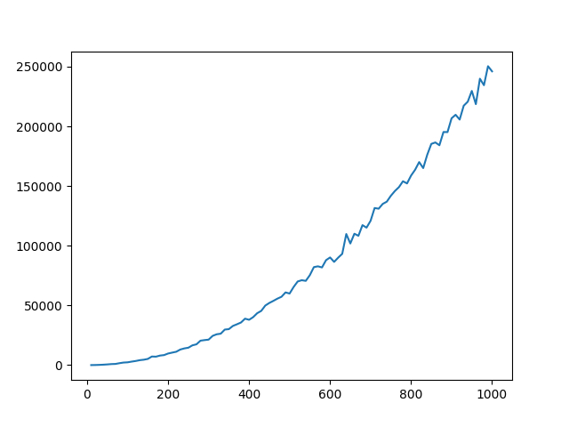
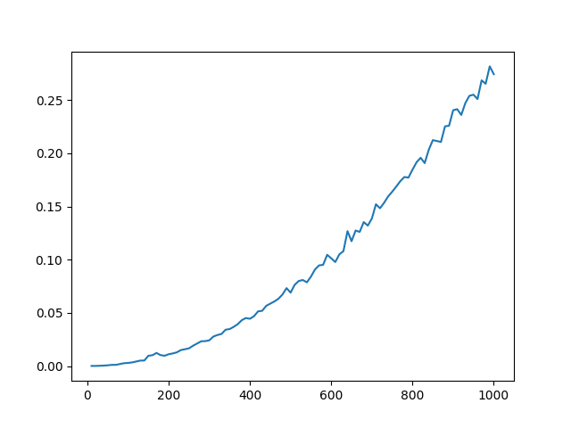
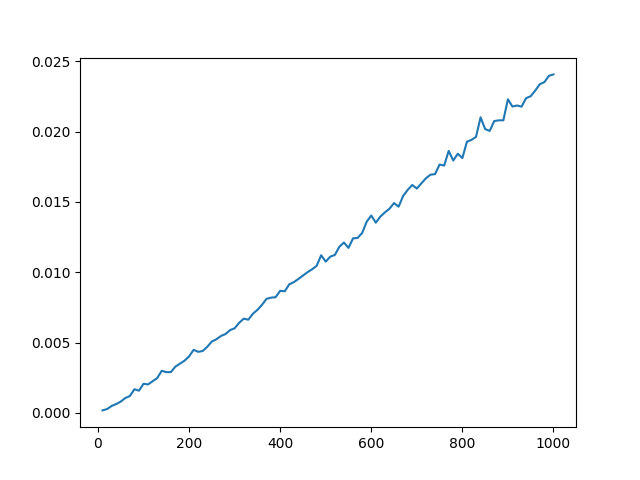

# 정렬 알고리즘
## 버블 정렬(Bubble Sort)
* 리스트 크기-연산 횟수 그래프
  
* 리스트 크기-연산 시간 그래프
  
## 선택 정렬(Selection Sort)
* 리스트 크기-연산 횟수 그래프
  
* 리스트 크기-연산 시간 그래프
    
## 삽입 정렬(Insertion Sort)
* 리스트 크기-연산 횟수 그래프
  
* 리스트 크기-연산 시간 그래프
    
## 병합 정렬(Merge Sort)
* 리스트 크기-연산 시간 그래프
    
## 힙 정렬(Heap Sort)
## 퀵 정렬(Quick Sort)